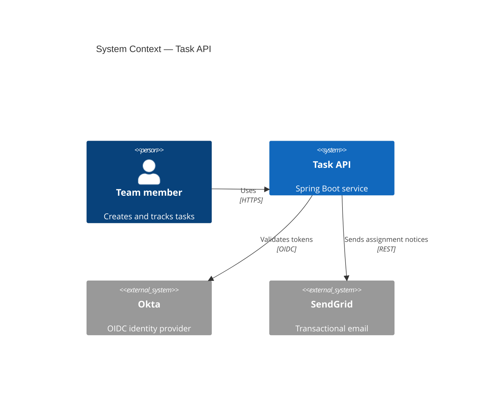
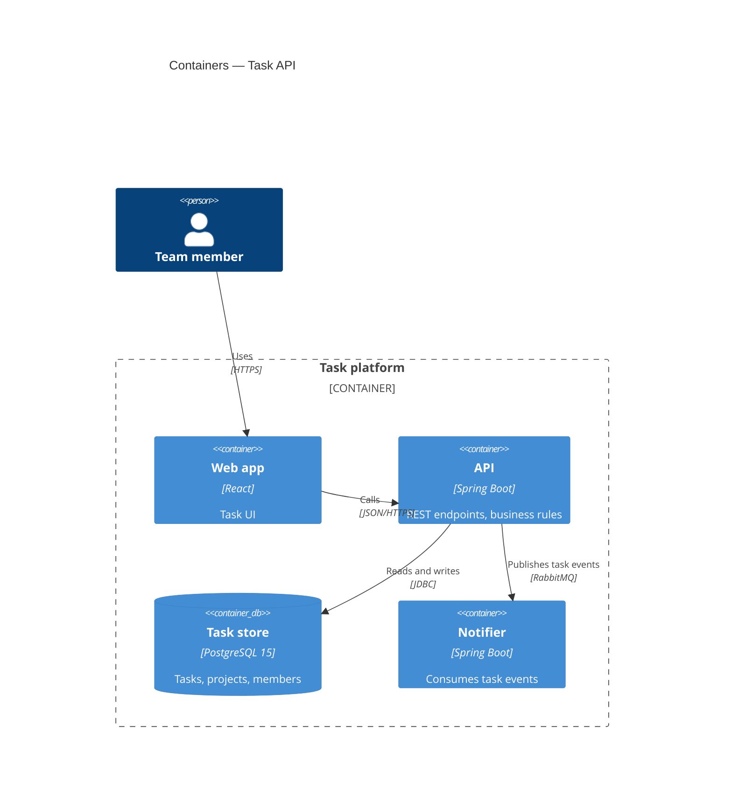
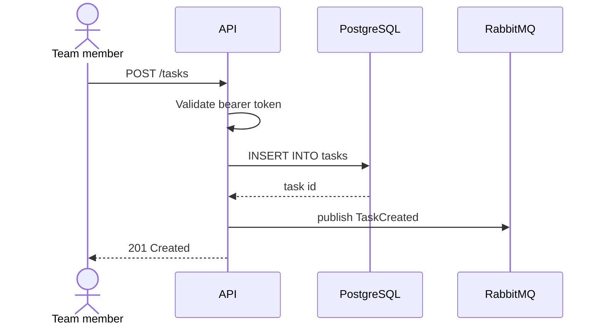
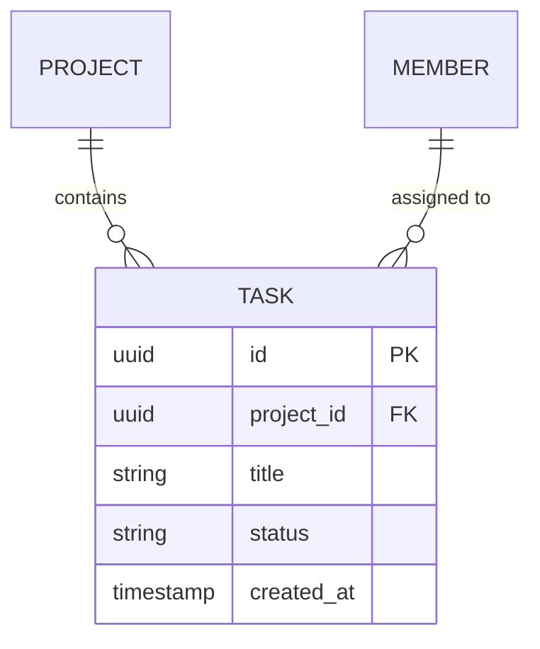
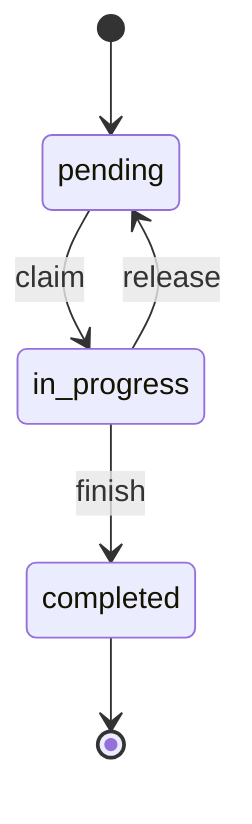

# Diagrams

Pick the diagram that answers the question being asked. A diagram that shows everything shows nothing.

## Selection

| Question the reader has | Diagram |
| :--- | :--- |
| What is this system, and who or what talks to it? | C4 Context |
| What gets deployed, and how do the pieces communicate? | C4 Container |
| What is inside this one service? | C4 Component |
| What happens, in order, when someone does X? | Sequence |
| What does the database look like? | ER |
| What states can this record be in? | State |
| How does this business process branch? | Flowchart |
| What runs on which machine or cluster? | Deployment |

**State vs flowchart:** a state diagram tracks one entity's lifecycle (`Order: pending → paid → shipped`). A flowchart tracks a process with decisions (registration, checkout). Choosing the wrong one produces a diagram nobody can read.

## C4 levels

| Level | Shows | Audience | When |
| :--- | :--- | :--- | :--- |
| 1 — Context | The system as one box, plus users and external systems | Anyone, including non-technical | Always |
| 2 — Container | Deployable units: apps, APIs, databases, queues | Tech leads, architects | Almost always |
| 3 — Component | Modules inside one container | Developers on that container | Only for containers complex enough to need it |
| 4 — Code | Classes | Rarely useful | Skip — the code is the diagram |

Zoom in only where the complexity is. Three Context diagrams for three services beat one Component diagram of everything.

## Mermaid

Prefer Mermaid: it renders in GitHub, GitLab, and most doc sites without a build step.

**C4 Context**

**C4 Container**

**Sequence**

**ER**

**State**

## Rules

- **Label every relationship** with both the action and the protocol: "Reads and writes / JDBC", never a bare arrow.
- **Name the technology** on each container. "API" is useless; "API — Spring Boot 3.2" is documentation.
- **One diagram, one level.** Mixing containers and classes in one picture is the most common failure.
- **Diagram what the code shows.** If the manifest declares three replicas, the deployment diagram shows three.
- **Keep the source in the repo.** Commit the Mermaid block in Markdown, not an exported PNG — an image cannot be diffed or corrected.
- **Cap it at roughly nine boxes.** Past that, split into a parent diagram and a zoomed child.

## PlantUML

Reach for PlantUML only when Mermaid cannot express the diagram — detailed deployment topologies, complex class hierarchies, or when the repo already standardizes on `.puml`. It needs a renderer, so match whatever the project already uses.
